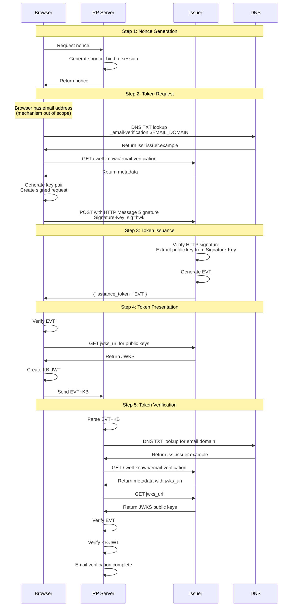

%%%
title = "Email Verification Protocol"
abbrev = "EVP"
ipr = "trust200902"
area = "Security"
workgroup = "TBD"
keyword = ["email", "verification", "identity", "authentication"]

[seriesInfo]
status = "standard"
name = "Internet-Draft"
value = "draft-hardt-email-verification-latest"
stream = "IETF"

date = 2026-01-06T00:00:00Z

[[author]]
initials = "D."
surname = "Hardt"
fullname = "Dick Hardt"
organization = "Hellō"
  [author.address]
  email = "dick.hardt@gmail.com"

%%%

.# Abstract

This document defines the Email Verification Protocol (EVP), which enables web applications to verify that a user controls an email address without sending a verification email. The protocol uses a three-party model where the browser intermediates between the relying party and an issuer, providing both improved user experience and privacy protection.

.# Discussion Venues

*Note: This section is to be removed before publishing as an RFC.*

Source for this draft and an issue tracker can be found at https://github.com/dickhardt/email-verification.

The browser API aspects are developed separately at the W3C WICG: https://github.com/WICG/email-verification-protocol

{mainmatter}

# Introduction

## The Problem

Web applications verify email addresses for two purposes:

1. **To send emails to the user** — transactional notifications, marketing, password resets
2. **To identify the user** — as a stable identifier for account creation and authentication

The standard verification method is to send a one-time code to the email address and have the user enter it. This requires the user to switch to their email client, wait for the message, find it, read the code, and return to enter it. Studies show non-completion rates of 20-40%.

**SMS verification had the same problem**

Phone number verification uses the same one-time code pattern: send a code via SMS, have the user enter it. This had similar friction until the industry developed standards to streamline it.

**How SMS solved it**

The WebOTP API and the `autocomplete="one-time-code"` HTML attribute enable SMS codes to auto-fill with a single tap. The SMS arrives within seconds, the operating system parses the origin-bound code format, and the browser offers to fill it automatically. The user never leaves the application.

**Why email cannot use the same approach**

Email verification cannot benefit from these standards:

- **Latency**: SMS arrives in seconds; email takes seconds to minutes depending on server processing, spam filtering, and delivery queues.
- **Spam filtering**: Verification emails frequently land in spam or promotions folders. SMS has no equivalent filtering.
- **Distraction**: When users switch to their email client, they see their entire inbox. Many get sidetracked by other messages and never return. SMS notifications appear briefly; there is no "SMS inbox" to get lost in.
- **No autofill path**: There is no mechanism for the operating system to parse an email and offer one-tap autofill back to the originating browser tab.

**Optimizations that exist today**

Two approaches optimize away the email code flow:

1. **Social login**: When a user is already authenticated with Google, Apple, or another identity provider, the application can obtain a verified email without sending any verification message. However, this requires the user to have and use a social account, and requires developers to integrate with each provider.

2. **Email Verification Protocol (EVP)**: This specification. When the user is logged into their email provider (as most users are in their browser), EVP enables instant verification without sending an email and without leaving the page.

Both are optimizations. The email code flow remains the universal fallback—it works for any email address regardless of provider support. But for users who are logged into a supporting provider, these optimizations eliminate the friction entirely.

**The privacy advantage of EVP**

Beyond user experience, there is a privacy dimension. Both email OTP and social login reveal to a third party which applications the user interacts with—the email provider sees verification emails, and the identity provider sees OAuth redirects. EVP is designed to prevent this: the issuer never learns which application requested verification. See [Privacy Protection](#privacy-protection) for details.

## The Solution

The Email Verification Protocol enables a web application to obtain a verified email address **without sending an email** and **without the user leaving the web page**. The user simply selects their email address from the browser's autocomplete, and verification happens instantly in the background.

To enable this functionality, the mail domain delegates email verification to an issuer that has authentication cookies for the user. When the user provides an email to the HTML form field, the browser calls the issuer using an HTTP Message Signed request ([RFC 9421](https://datatracker.ietf.org/doc/html/rfc9421)), passing authentication cookies and the browser's public key via the Signature-Key header ([draft-hardt-httpbis-signature-key](https://datatracker.ietf.org/doc/draft-hardt-httpbis-signature-key/)). The issuer returns a token, which the browser verifies and updates and provides to the web application. The web application then verifies the token and has a verified email address for the user.

## Privacy Protection

When an application only wants the email address to identify the user—not to send emails—the verification method determines what third parties learn about the user's activity:

**Email OTP**: The email provider learns which applications the user is interacting with and when, through the verification emails it delivers. The provider sees the sender, subject line, and delivery timing for every verification. If the application will send emails anyway (welcome messages, notifications), this disclosure is unavoidable. But for applications that only need the email for identification, sending a verification email creates an unnecessary privacy leak.

**Social login**: The identity provider learns which applications the user visits, because the application redirects the user to the provider and identifies itself in the OAuth request. The provider sees every login across every application.

**EVP's three-party model**: EVP is designed so the issuer never learns which application requested verification. The browser intermediates between the RP and the issuer, obtaining an issuance token (EVT) from the issuer and then creating a separate presentation token (EVT+KB) for the RP. This architectural indirection—rather than a simple API where the issuer creates a token directly for the application—ensures the issuer cannot track which applications the user interacts with.

This is accomplished through key binding: the browser generates a fresh key pair, the issuer binds the EVT to that public key (in the `cnf` claim), and the browser uses the private key to create a Key Binding JWT (KB-JWT) that includes the RP's audience and nonce. The issuer never sees the RP's identity; it only sees the browser's ephemeral public key.

**When privacy protection matters**: This protection is most important when the email is being used by the RP to identify the user (e.g., for login or account linking). If the RP subsequently sends an email to the user anyway (e.g., a welcome email), the email provider will learn about that interaction through traditional email transmission. However, even in these cases, the issuer (which may be separate from the email provider) does not learn which RPs requested verification, and the timing of verification requests is not revealed through email metadata.


## Key Concepts


- **EVT (Email Verification Token)**: An Email Verification Token is a JWT issued by an issuer that asserts the user controls a specific email address. The EVT contains the `email` and `email_verified` claims for the user, and the public key used by the browser to make the request in the `cnf` (confirmation) claim. The EVT uses the same structure as an SD-JWT (Selective Disclosure JWT) as specified in [Selective Disclosure for JWT](https://datatracker.ietf.org/doc/draft-ietf-oauth-selective-disclosure-jwt/), but does not use the selective disclosure features - it only uses the key binding capability. EVTs can be parsed and validated using standard SD-JWT libraries.

- **EVT+KB (Email Verification Token with Key Binding)**: The presentation token composed of an EVT and a Key Binding JWT (KB-JWT) separated by the `~` character. The KB-JWT is signed by the browser and contains a hash of the EVT along with the RP's audience and nonce. This two-part structure enables a separation of token issuance and token presentation: the issuer creates the EVT without knowing which RP will receive it, and the browser binds the EVT to a specific RP through the KB-JWT. This enables the RP to verify the issuer provided the email address for the user without the issuer learning about the specific application.

- **Issuer**: The service that verifies the user controls an email address. A DNS record for the email domain delegates email verification to the issuer. The issuer serves a `.well-known/email-verification` metadata file that contains its `issuance_endpoint` that is called to obtain an EVT, and its `jwks_uri` that points to the JWKS file containing the public keys used to verify the EVT. The issuer is identified by its domain, an eTLD+1 (eg `issuer.example`). The hostname in all URLs from the issuer's metadata MUST end with the issuer's domain. This identifier is what binds the EVT, the DNS delegation, with the issuer.

- **HTTP Message Signatures**: This protocol uses [RFC 9421](https://datatracker.ietf.org/doc/html/rfc9421) to sign the HTTP request from the browser to the issuer. The signature binds the browser's public key, the cookies, and the request content together in a verifiable way.

- **Signature-Key Header**: The browser's public key is transmitted using the Signature-Key header with the `hwk` (Header Web Key) scheme as defined in [draft-hardt-httpbis-signature-key](https://datatracker.ietf.org/doc/draft-hardt-httpbis-signature-key/). This provides a self-contained, pseudonymous way to distribute the public key inline with the request.

## Scope

This document specifies the IETF protocol aspects of email verification: the HTTP-level interactions between the browser, issuer, and relying party. How the browser obtains the email address from the user (browser APIs, user interface elements, etc.) is out of scope for this specification and is addressed in separate W3C work.

**Note on deliverability**: This protocol verifies that the user controls an email address. It does not verify that the email address can receive mail. An issuer may verify addresses that exist only as aliases, or addresses at domains with misconfigured mail servers. RPs that intend to send email should still handle delivery failures appropriately.

# Protocol Flow

The protocol consists of five steps:

1. Nonce Generation
2. Token Request
3. Token Issuance
4. Token Presentation
5. Token Verification





## Nonce Generation

Before requesting email verification, the browser obtains a nonce from the RP:

- **1.1** - The browser requests a nonce from the RP Server (mechanism for this request is out of scope - may be via XHR, fetch, or server-rendered in HTML)

- **1.2** - The RP Server generates a cryptographically random nonce and binds it to the user's session

- **1.3** - The RP Server returns the nonce to the browser

The nonce will be included in the Key Binding JWT (step 4) to bind the verification to this specific RP session and prevent replay attacks.


## Token Request

Once the browser has obtained an email address (mechanism out of scope) and a nonce from the RP:

- **2.1** - The browser parses the email domain ($EMAIL_DOMAIN) from the email address, looks up the `TXT` record for `_email-verification.$EMAIL_DOMAIN`. The contents of the record MUST start with `iss=` followed by the issuer identifier. There MUST be only one `TXT` record for `_email-verification.$EMAIL_DOMAIN`.

Example record:

```bash
_email-verification.email-domain.example   TXT   iss=issuer.example
```

This record states that `email-domain.example` has delegated email verification to the issuer `issuer.example`.

If the email domain and the issuer are the same domain, then the record would be:

```bash
_email-verification.issuer.example   TXT   iss=issuer.example
```

> Access to DNS records and email is often independent of website deployments. This provides assurance that an issuer is truly authorized as an insider with only access to websites on `issuer.example` could not setup an issuer that would grant them verified emails for any email at `issuer.example`.

- **2.2** - If an issuer is found, the browser loads `https://$ISSUER$/.well-known/email-verification` and MUST follow redirects to the same path but with a different subdomain of the Issuer.

For example, `https://issuer.example/.well-known/email-verification` may redirect to `https://accounts.issuer.example/.well-known/email-verification`.


- **2.3** - The browser confirms that the `.well-known/email-verification` file contains JSON that includes the following properties:

- *issuance_endpoint* - the API endpoint the browser calls to obtain an EVT
- *jwks_uri* - the URL where the issuer provides its public keys to verify the EVT
- *signing_alg_values_supported* - OPTIONAL. JSON array containing a list of the signing algorithms ("alg" values) supported by the issuer for both HTTP Message Signatures and issued EVTs. Algorithm identifiers MUST be from the IANA "JSON Web Signature and Encryption Algorithms" registry. If omitted, "EdDSA" is the default. "EdDSA" SHOULD be included in the supported algorithms list. The value "none" MUST NOT be used.

Each of these properties MUST include the issuer domain as the root of their hostname.

Following is an example `.well-known/email-verification` file:

```json
{
  "issuance_endpoint": "https://accounts.issuer.example/email-verification/issuance",
  "jwks_uri": "https://accounts.issuer.example/email-verification/jwks",
  "signing_alg_values_supported": ["EdDSA", "RS256"]
}
```

- **2.4** - The browser generates a fresh private / public key pair. The browser SHOULD select an algorithm from the issuer's `signing_alg_values_supported` array, or use "EdDSA" if the property is not present.

- **2.5** - The browser creates an HTTP Message Signature ([RFC 9421](https://datatracker.ietf.org/doc/html/rfc9421)) request by:

  - Creating a JSON request body with the email address:
    ```json
    {
      "email": "user@example.com"
    }
    ```

  - Computing the `Content-Digest` header per [RFC 9530](https://datatracker.ietf.org/doc/html/rfc9530) using SHA-256:
    ```
    Content-Digest: sha-256=:X48E9qOokqqrvdts8nOJRJN3OWDUoyWxBf7kbu9DBPE=:
    ```

  - Creating the `Signature-Input` header specifying which components to sign:
    ```
    Signature-Input: sig=("@method" "@target-uri" "@authority" "content-digest" "cookie" "sec-fetch-dest"); created=1692345600; keyid="browser-key"; alg="ed25519"
    ```

  - Computing the signature base per RFC 9421 Section 2.5 and signing it with the browser's private key

  - Creating the `Signature` header with the base64-encoded signature:
    ```
    Signature: sig=:MEQCIHd8Y8qYKm5e3dV8y....:
    ```

  - Creating the `Signature-Key` header using the `hwk` scheme ([draft-hardt-httpbis-signature-key](https://datatracker.ietf.org/doc/draft-hardt-httpbis-signature-key/)) with the browser's public key:
    ```
    Signature-Key: sig=hwk; kty="OKP"; crv="Ed25519"; x="JrQLj5P_89iXES9-vFgrIy29clF9CC_oPPsw3c5D0bs"
    ```

- **2.6** - The browser POSTs to the `issuance_endpoint` of the issuer with 1P cookies:

```http
POST /email-verification/issuance HTTP/1.1
Host: accounts.issuer.example
Cookie: session=...
Content-Type: application/json
Content-Digest: sha-256=:X48E9qOokqqrvdts8nOJRJN3OWDUoyWxBf7kbu9DBPE=:
Sec-Fetch-Dest: email-verification
Signature-Input: sig=("@method" "@target-uri" "@authority" "content-digest" "cookie" "sec-fetch-dest"); created=1692345600; keyid="browser-key"; alg="ed25519"
Signature: sig=:MEQCIHd8Y8qYKm5e3dV8y....:
Signature-Key: sig=hwk; kty="OKP"; crv="Ed25519"; x="JrQLj5P_89iXES9-vFgrIy29clF9CC_oPPsw3c5D0bs"

{"email":"user@example.com"}
```

## Token Issuance

On receipt of a token request from the browser:

- **3.1** - The issuer MUST verify the request headers:

  - `Content-Type` is `application/json`
  - `Sec-Fetch-Dest` is `email-verification`
  - `Content-Digest` is present
  - `Signature-Input` is present
  - `Signature` is present
  - `Signature-Key` is present with `sig=hwk` scheme

- **3.2** - The issuer MUST verify the HTTP Message Signature per [RFC 9421](https://datatracker.ietf.org/doc/html/rfc9421) by:

  - Parsing the `Signature-Key` header and extracting the public key from the `hwk` parameters (`kty`, `crv`, `x` for OKP keys)
  - Parsing the `Signature-Input` header to determine the covered components
  - Verifying that the signature covers at minimum: `@method`, `@target-uri`, `@authority`, `content-digest`, `cookie`, and `sec-fetch-dest`
  - Reconstructing the signature base per RFC 9421 Section 2.5
  - Verifying the signature in the `Signature` header using the extracted public key
  - Verifying the `created` timestamp in `Signature-Input` is within 60 seconds of the current time

- **3.3** - The issuer MUST verify the request body:

  - Parsing the JSON body and extracting the `email` field
  - Verifying the `email` field contains a syntactically valid email address
  - Verifying the `Content-Digest` matches the actual request body

- **3.4** - The issuer checks if the cookies sent represent a logged in user, and if the logged in user has control of the email provided in the request body. If so the issuer generates an EVT with the following properties:

  - **Header**: MUST contain
    - `alg`: signing algorithm (SHOULD match the algorithm from the HTTP Message Signature)
    - `kid`: key identifier of key used to sign
    - `typ` set to "evt+jwt"
  - **Payload**: MUST contain the following claims:
    - `iss`: the issuer identifier
    - `iat`: issued at time
    - `cnf`: confirmation claim containing the public key from the Signature-Key header's `hwk` parameters
    - `email`: claim containing the email address from the request body
    - `email_verified`: claim that email is verified per OpenID Connect 1.0
  - **Signature**: MUST be signed with the issuer's private key corresponding to a public key in the `jwks_uri` identified by `kid`


Example header:
  ```json
  {
    "alg": "EdDSA",
    "kid": "2024-08-19",
    "typ": "evt+jwt"
  }
  ```

Example payload:
  ```json
  {
    "iss": "issuer.example",
    "iat": 1724083200,
    "cnf": {
      "jwk": {
        "kty": "OKP",
        "crv": "Ed25519",
        "x": "JrQLj5P_89iXES9-vFgrIy29clF9CC_oPPsw3c5D0bs"
      }
    },
    "email": "user@example.com",
    "email_verified": true
  }
  ```
The resulting JWT has the `~` appended to it, making it compatible with the SD-JWT structure (though this protocol does not use selective disclosure features). Standard SD-JWT libraries can be used to parse and validate EVTs.

- **3.5** - The issuer returns the EVT to the browser as the value of `issuance_token` in an `application/json` response.

Example:
```bash
HTTP/1.1 200 OK
Content-Type: application/json

{"issuance_token":"eyJhbGciOiJFZERTQSIsImtpZCI6IjIwMjQtMDgtMTkiLCJ0eXAiOiJ3ZWItaWRlbnRpdHkrc2Qtand0In0..."}
```

## Error Responses

If the issuer cannot process the token request successfully, it MUST return an appropriate HTTP status code with a JSON error response containing an `error` field and optionally an `error_description` field.


### Invalid Content-Type Header

When the request does not include the required `Content-Type: application/json` header, the server MUST return the 415 HTTP response code


### Invalid Sec-Fetch-Dest Header

When the request does not include the required `Sec-Fetch-Dest: email-verification` header:

**HTTP 400 Bad Request**
```json
{
  "error": "invalid-request",
  "error_description": "Missing or invalid Sec-Fetch-Dest header"
}
```

The `error_description` SHOULD specify that the Sec-Fetch-Dest header is missing or invalid.

### Invalid or Missing HTTP Message Signature

When the HTTP Message Signature is missing, malformed, or verification fails:

**HTTP 400 Bad Request**
```json
{
  "error": "invalid_signature",
  "error_description": "HTTP Message Signature verification failed"
}
```

This includes cases where:
- The `Signature`, `Signature-Input`, or `Signature-Key` headers are missing
- The `Signature-Key` header does not use the `hwk` scheme or is malformed
- The signature does not cover the required components
- The signature verification fails using the public key from `Signature-Key`
- The `created` timestamp is outside the acceptable time window

### Invalid Content-Digest

When the `Content-Digest` header is missing or does not match the request body:

**HTTP 400 Bad Request**
```json
{
  "error": "invalid_request",
  "error_description": "Content-Digest header missing or does not match request body"
}
```

### Authentication Required

When the request lacks valid authentication cookies, contains expired/invalid cookies, or the authenticated user does not have control of the requested email address:

**HTTP 401 Unauthorized**
```json
{
  "error": "authentication_required",
  "error_description": "User must be authenticated and have control of the requested email address"
}
```

### Invalid Parameters

When the request body is malformed, missing the `email` field, or contains invalid values:

**HTTP 400 Bad Request**
```json
{
  "error": "invalid_request",
  "error_description": "Invalid or malformed request body"
}
```

### Server Errors

For internal server errors or temporary unavailability:

**HTTP 500 Internal Server Error**
```json
{
  "error": "server_error",
  "error_description": "Temporary server error, please try again later"
}
```


> In a future version of this spec, the issuer could prompt the user to login via a URL or with a Passkey request.


## Token Presentation

On receiving the `issuance_token` from the issuer:

- **4.1** - The browser MUST verify the EVT by:

  - parsing the EVT into header, payload, and signature components
  - confirming the presence of, and extracting the `alg` and `kid` fields from the EVT header, and the `iss`, `iat`, `cnf`, `email`, and `email_verified` claims from the payload
  - parsing the email domain from the `email` claim and looking up the `TXT` record for `_email-verification.$EMAIL_DOMAIN` to verify the `iss` claim matches the issuer identifier in the DNS record
  - fetching the issuer's public keys from the `jwks_uri` specified in the `.well-known/email-verification` file
  - verifying the EVT signature using the public key identified by `kid` from the JWKS with the `alg` algorithm
  - verifying the `iat` claim is within 60 seconds of the current time
  - verifying the `email` claim matches the email address being verified
  - verifying the `email_verified` claim is true
  - verifying the `cnf.jwk` claim matches the public key the browser generated in step 2.4


- **4.2** - The browser then creates an EVT+KB by:

  - taking the verified EVT from step 4.1 as the base token
  - creating a Key Binding JWT (KB-JWT) with the following structure:
    - **Header**:
      - `alg`: same signing algorithm used by the browser's private key
      - `typ`: "kb+jwt"
    - **Payload**:
      - `aud`: the RP's origin
      - `nonce`: the nonce from step 1
      - `iat`: current time when creating the KB-JWT
      - `sd_hash`: SHA-256 hash of the EVT
  - signing the KB-JWT with the browser's private key (the same key pair generated in step 2.4)
  - concatenating the EVT and the KB-JWT separated by a tilde (~) to form the EVT+KB

  Example KB-JWT header:
  ```json
  {
    "alg": "EdDSA",
    "typ": "kb+jwt"
  }
  ```

  Example KB-JWT payload:
  ```json
  {
    "aud": "https://rp.example",
    "nonce": "259c5eae-486d-4b0f-b666-2a5b5ce1c925",
    "salt": "kR7fY9mP3xQ8wN2vL5jH6tZ1cB4nM9sD8fG3hJ7kL2p",
    "iat": 1724083260,
    "sd_hash": "X9yH0Ajrdm1Oij4tWso9UzzKJvPoDxwmuEcO3XAdRC0"
  }
  ```

- **4.3** - The browser provides the EVT+KB to the RP (mechanism out of scope for this specification - see W3C browser API specification)

## Token Verification

The RP receives the EVT+KB from the browser (mechanism out of scope) and the RP server MUST verify it by:

- **5.1** - Parsing the EVT+KB by separating the EVT and KB-JWT components (separated by tilde ~)

- **5.2** - Verifying the KB-JWT by:
  - parsing the KB-JWT into header, payload, and signature components
  - confirming the presence of, and extracting the `alg` field from the KB-JWT header, and the `aud`, `nonce`, `iat`, and `sd_hash` claims from the payload
  - verifying the `aud` claim matches the RP's origin
  - verifying the `nonce` claim matches the nonce from the RP's session (from step 1)
  - verifying the `iat` claim is within a reasonable time window
  - computing the SHA-256 hash of the EVT and verifying it matches the `sd_hash` claim

- **5.3** - Verifying the EVT by:
  - parsing the EVT into header, payload, and signature components
  - confirming the presence of, and extracting the `alg` and `kid` fields from the EVT header, and the `iss`, `iat`, `cnf`, `email`, and `email_verified` claims from the payload
  - parsing the email domain from the `email` claim and looking up the `TXT` record for `_email-verification.$EMAIL_DOMAIN` to verify the `iss` claim matches the issuer identifier in the DNS record
  - fetching the issuer's public keys from the `jwks_uri` specified in the `.well-known/email-verification` file
  - verifying the EVT signature using the public key identified by `kid` from the JWKS with the `alg` algorithm
  - verifying the `iss` claim exactly matches the issuer identifier from the DNS record
  - verifying the `iat` claim is within a reasonable time window
  - verifying the `email_verified` claim is true

- **5.4** - Verifying the KB-JWT signature using the public key from the `cnf` claim in the EVT with the `alg` algorithm from the KB-JWT header

- **5.5** - If all verification steps pass, the RP has successfully verified that the user controls the email address in the `email` claim

> **Note**: Standard SD-JWT libraries can be used to parse and validate EVTs, as EVTs use the same structure as SD-JWTs (JWT with `~` suffix).


# Privacy Considerations

> Below are notes capturing some discussions of potential privacy implications.

1. The email domain operator no longer learns which applications the user is verifying their email address to as the applications are no longer sending an email verification code to the user. By using an EVT+KB, the browser intermediates the request and response so that the issuer does not learn the identity of the RP.

2. The RP can infer if a user is logged into the issuer as the RP receives an EVT when the user is logged in, and does not when the user is not logged in.

3. The issuer may learn the user has email at a mail domain it is authoritative for that it did not know the user had.

# Security Considerations

## HTTP Message Signature Security

The use of HTTP Message Signatures ([RFC 9421](https://datatracker.ietf.org/doc/html/rfc9421)) provides several security benefits:

1. **Request Integrity**: The signature covers the HTTP method, target URI, authority, content-digest, cookies, and security headers, preventing tampering with any of these components.

2. **Cookie Binding**: By including the `cookie` component in the signature, the browser's authentication cookies are cryptographically bound to the specific request, preventing cookie injection or manipulation attacks.

3. **Replay Protection**: The `created` timestamp in the `Signature-Input` header is verified to be within 60 seconds, preventing replay attacks.

4. **Public Key Binding**: The browser's public key transmitted via the `Signature-Key` header with the `hwk` scheme is bound to the request signature, ensuring the issuer knows which public key to include in the EVT's `cnf` claim.

## Signature-Key hwk Scheme

The `hwk` (Header Web Key) scheme provides:

1. **Self-Contained Key Distribution**: The public key is transmitted inline, eliminating the need for a separate key lookup or registration process.

2. **Pseudonymity**: The browser does not need to identify itself - the key serves as a pseudonymous identifier for the request.

3. **Ephemeral Keys**: The browser generates fresh key pairs for each verification flow, limiting the correlation potential across different verification attempts.

## Email Existence Probing

A successful EVP verification confirms that an email address exists and is controlled by a logged-in user. This could potentially be used to:

1. **Build email lists**: An attacker could probe many addresses to identify valid ones for spam targeting.
2. **Account enumeration**: An attacker could determine which email addresses have accounts at specific issuers.

These risks are mitigated by:

- **User interaction required**: The browser API requires user gesture and consent before initiating verification. Automated probing is not possible.
- **Rate limiting**: Issuers can rate-limit requests per user session or IP address.
- **Same information as email OTP**: An attacker can already determine email existence by sending verification emails and checking for bounces. EVP does not create new information disclosure.

Issuers should implement appropriate rate limiting and abuse detection.

# Design Rationale

## Why Not Solve Email Like SMS OTP?

The WebOTP API and `autocomplete="one-time-code"` standards dramatically reduced friction for SMS verification. A natural question is why email verification cannot use the same approach. Several fundamental differences make this impractical:

**SMS is a mobile OS feature; email is application-layer**

SMS is integrated into mobile operating systems. The OS receives incoming messages and can parse them before any application sees them. This privileged position enables the OS to recognize origin-bound OTP formats and offer autofill directly to the browser.

Email operates at the application layer. There is no OS-level email subsystem that intercepts incoming messages. Email clients are ordinary applications—whether native apps, desktop programs, or web applications—with no special ability to coordinate with browsers for autofill.

**SMS verification is mobile; email verification spans platforms**

SMS OTP autofill works on mobile devices where the OS controls the messaging stack. Email verification happens on desktop computers, laptops, tablets, and phones. Any solution for email must work across all these platforms, not just mobile.

**SMS senders are aggregators; email senders are RPs**

SMS verification messages are typically sent through aggregator services (Twilio, AWS SNS, etc.) that send on behalf of many relying parties. The "sender" of the SMS is often a short code or phone number shared across multiple services. This means the phone number or sender ID carries little identifying information about which RP sent the message.

Email verification messages come directly from the RP's domain. The sender address, domain, and email headers identify the RP. This architectural difference means that email verification inherently reveals more about the RP to the email provider than SMS verification reveals to the carrier.

## Why the Three-Party Model?

A simpler design would have the issuer create a token directly for the RP, with the RP as the audience. This is how social login works: the identity provider knows which application the user is logging into.

EVP uses a three-party model where the browser intermediates between the issuer and the RP. The issuer creates an EVT bound to the browser's ephemeral public key, and the browser creates a separate KB-JWT that binds the EVT to the RP. The issuer never learns the RP's identity.

This design choice is driven by privacy: for users with domain-based email accounts (personal domains, work accounts), the email provider should not learn which applications the user accesses. The architectural complexity of the three-party model is justified by this privacy benefit.

## Why SD-JWT?

The EVT uses the SD-JWT structure (specifically, the key binding capability from SD-JWT+KB) rather than a plain JWT. This choice provides:

1. **Key Binding**: The `~` separator and KB-JWT mechanism provide a standard way to bind a token to a holder's key, enabling the three-party model where issuance and presentation are separate operations.

2. **Library Support**: SD-JWT libraries already exist and can parse EVTs, reducing implementation burden for RPs.

3. **Extensibility**: While EVP does not currently use selective disclosure, the SD-JWT structure allows future extensions without changing the token format.

## Why DNS Delegation?

The mail domain delegates email verification to an issuer via a DNS TXT record rather than a `.well-known` file. This choice aligns with how email infrastructure already works:

1. **Email domains often lack web hosting**: Many users have personal domains used only for email. Requiring a web server to host a `.well-known` file would create a barrier to adoption.

2. **Apex domain challenges**: Email domains are typically apex domains (e.g., `example.com`), which do not support CNAME records. Hosting a web site on an apex domain requires additional infrastructure.

3. **Familiar tooling**: Domain owners already manage DNS records for email (MX, SPF, DKIM, DMARC). Adding another TXT record fits existing workflows.

## Why JWKS Over DKIM Keys?

The issuer publishes signing keys via a JWKS endpoint rather than reusing DKIM keys. While DKIM keys are already associated with email domains, JWKS provides practical advantages:

1. **Key rotation**: DKIM keys are rarely rotated in practice. JWKS rotation is common in OIDC deployments and follows established patterns.

2. **Algorithm flexibility**: JWKS supports multiple key types and algorithms. DKIM key distribution was designed for a specific use case.

3. **Operational familiarity**: Developers implementing EVP are likely familiar with JWKS from OAuth/OIDC work.

# Alternatives Under Consideration

## Passkey Authentication

In addition to, or instead of the browser sending cookies to the Issuer, the Issuer could return a WebAuthN request to the browser if it has credentials for the user identified by the email address. The browser would then interact with the user and provide the WebAuthN response to the Issuer, authenticating the user, and the Issuer would then return the EVT.

# Alternatives Considered

## Use .wellknown for Mail Domain delegation to Issuer

Rather than the DNS TXT record, the Mail Domain would host a JSON file in the .wellknown domain. This creates challenges for the long tail of individually owned domains:

- would require a domain that is used just for email to now have to support a web server
- the mail domain is usually an apex domain, which does not support CNAME, complicating hosting a web site

## Use Request JWT Instead of HTTP Message Signatures

The original design used a JWT signed by the browser to carry the email address and browser's public key. The HTTP Message Signatures approach was chosen because:

1. **Standards-Based**: RFC 9421 is a published standard for signing HTTP messages, providing better interoperability
2. **Cookie Binding**: HTTP Message Signatures can directly sign the `cookie` header, providing stronger binding between authentication cookies and the request
3. **Content Integrity**: The `content-digest` component provides built-in content integrity without needing to duplicate the email in a JWT
4. **Flexibility**: The signature can cover any HTTP components, making it easier to add additional protections in the future
5. **Simpler Key Distribution**: The Signature-Key header provides a standardized way to distribute keys inline with the request

# References

- [RFC 9421: HTTP Message Signatures](https://datatracker.ietf.org/doc/html/rfc9421)
- [RFC 9530: Digest Fields](https://datatracker.ietf.org/doc/html/rfc9530)
- [draft-hardt-httpbis-signature-key: HTTP Signature-Key Header](https://datatracker.ietf.org/doc/draft-hardt-httpbis-signature-key/)
- [Selective Disclosure for JWT (SD-JWT)](https://datatracker.ietf.org/doc/draft-ietf-oauth-selective-disclosure-jwt/)
- [OpenID Connect Core 1.0](https://openid.net/specs/openid-connect-core-1_0.html)
